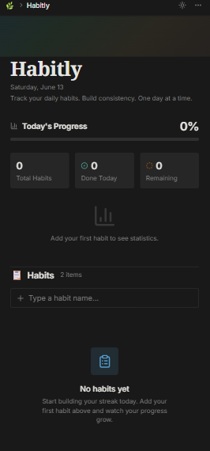

# Habitly


<p align="center">
  
  
  
  
  
  
  
  
</p>

Habitly is a modern habit tracking web application built with **React + Vite**, powered by **Redux Toolkit**, styled with **Tailwind CSS v4**, and enhanced with **PWA support**.

---

## Screenshots

Add app screenshots inside `public/screenshots/` and reference them here.




---

## Features

- React 19 + Vite
- Redux Toolkit for state management
- LocalStorage persistence
- Tailwind CSS v4 styling
- ShadCN UI components
- Toast notifications with React Hot Toast
- PWA ready with vite-plugin-pwa
- React Router v7 routing

---

## Project Structure

```text
habitly/
|-- public/
|   |-- screenshots/
|   |   `-- dashboard.png
|-- src/
|   |-- app/          # Redux store configuration
|   |-- components/   # Reusable UI components
|   |-- features/     # Redux slices
|   |-- lib/          # Utility helpers
|   |-- pages/        # Route pages
|   |-- pwa/          # PWA related config
|   |-- routes/       # Route management
|   |-- utils/        # Utility functions
|   |-- App.jsx
|   |-- main.jsx
|   `-- index.css
|-- index.html
|-- vite.config.js
`-- package.json
```

---

## Tech Stack

### Core

- React 19
- Vite 7

### State Management

- @reduxjs/toolkit
- react-redux

### Styling

- Tailwind CSS v4
- tailwind-merge
- class-variance-authority
- tw-animate-css

### UI & Icons

- ShadCN
- Radix UI
- Lucide React

### Routing

- react-router-dom v7

### Notifications

- react-hot-toast

### PWA

- vite-plugin-pwa

---

## Installation

```bash
git clone https://github.com/devajaypndey/Habitly.git
cd habitly/Habitly-client
npm install
npm run dev
```
